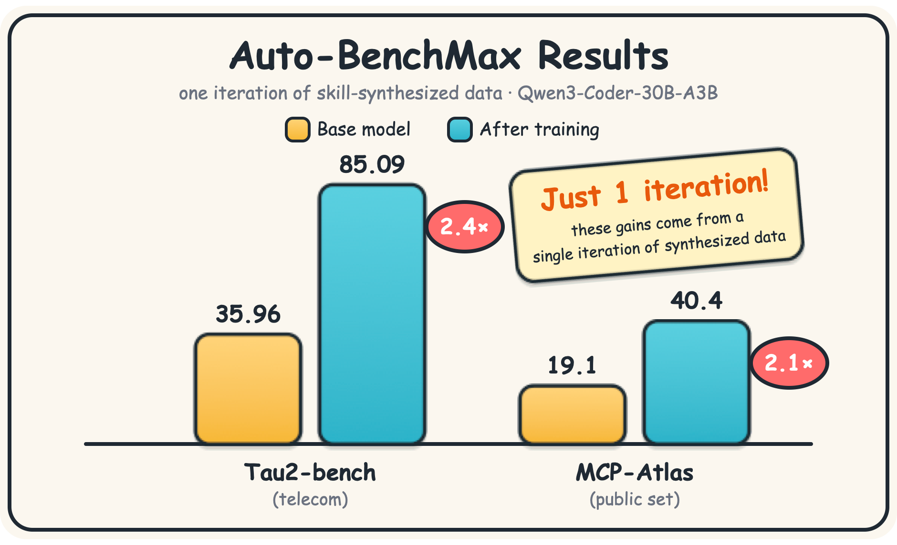
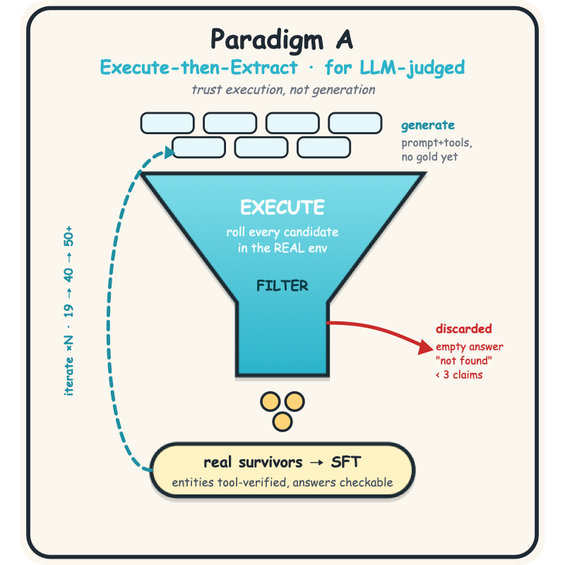
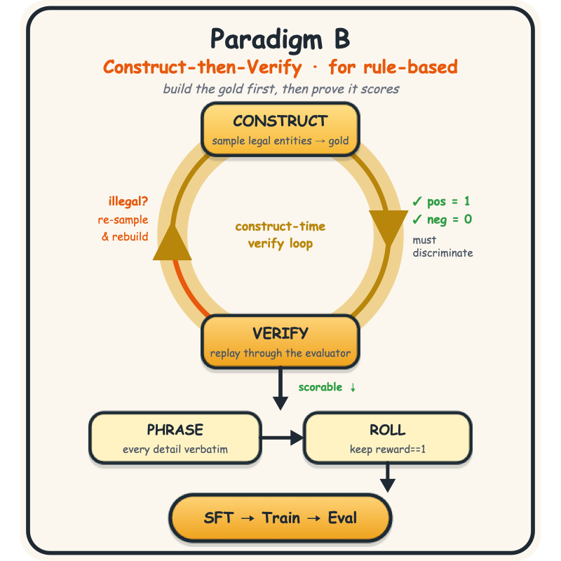

<div align="center">

[English](README.md) | [中文](README_zh.md)

# 🚀 Auto-BenchMax

**一键自动构建 benchmark 相关数据，base模型分数直接翻倍。**



</div>

---

## 💡 动机

> 有人说这是"国模最黑暗的时代"、"凛冬将至"，行业被拖入了面向投资人和 benchmark 数字开发的死循环，真正的技术积累反而被搁置了。

我不完全同意这种说法。但我也了解，很多从业者确实被刷 benchmark 分数的日常消耗了大量精力，无暇做真正有价值的工作。这对个人成长和国产模型的整体进步都是有害的。

为了方便社区使用和复现，本项目开源了：

- **Pipeline** — 数据构造流程
- **训练代码** — 复现训练的脚本
- **环境** — 在 MCP-Atlas benchmark 上应用此pipeline修改后的版本
- **数据** — 在该环境中使用此pipeline生成的训练数据

一键即可复现在 **MCP-Atlas**（OpenAI、Anthropic 等公司密切关注的 benchmark）上 **基座模型 2 倍得分** 的结果。

> 这里公开的数据来自 **第一轮迭代**。使用提供的训练脚本，分数从 **19.1**（基线）提升到 **40.4**。单轮迭代已经翻倍，多轮迭代可以突破 **50**。评测集为 **MCP-Atlas 公开集**。

---

## 🛠️ 为你自己的 Benchmark 合成数据

### **只需一句话：**

如果你使用支持 skill 的 agent（如 Claude Code），最简单的方式就是：把你的评测入口告诉它，让 skill 驱动整条流水线。例如：

> My eval launch command is `<your eval command>`. Read this skill and synthesize training data for this benchmark.

上面的复现使用的是我们公开的数据。如果你想为 **自己的 tool-use / agentic benchmark** 生成同分布数据，使用 [`skills/tool-use-data-synthesis/`](skills/tool-use-data-synthesis/) 下的 skill（详见 [`SKILL.md`](skills/tool-use-data-synthesis/SKILL.md)）。

Skill 会根据你的 benchmark 评分方式自动选择合成范式 — **Paradigm A** 用于 LLM 评判的 benchmark，**Paradigm B** 用于规则评判的 benchmark：

<div align="center">


</div>

Skill 会读取你的评测器，判断评分机制（规则 vs. LLM 评判），选择正确的合成范式，对齐 benchmark 的结构分布，滚动生成真实轨迹，输出训练数据 — 整个方法论详见 `SKILL.md`。

---

## 📂 仓库结构

```
Auto-BenchMax/
├── skills/
│   └── tool-use-data-synthesis/   # 核心 skill：方法论 + 驱动整条数据合成流水线的参考资料
├── codes/
│   ├── axolotl/                   # 训练代码，基于 axolotl 适配；配置在 benchmax_configs/，启动脚本在 benchmax_scripts/
│   └── mcp-atlas/                 # 评测环境 — MCP-Atlas benchmark 适配版，端到端运行我们的流水线，使用我们的pipeline进行了全自动化修改，自动生成benchmark相关数据
├── datas/
│   └── benchmax_sft_iter1.jsonl   # 第一轮 SFT 数据（1312 条 tool-use 样本），可直接训练
└── aseets/                        # README 中使用的图片
```

**关于 `codes/mcp-atlas/`：** 基于 Scale AI 的 [MCP-Atlas](https://scale.com/leaderboard/mcp_atlas) benchmark 适配。我们将流水线接入其中，使轨迹滚动、评测和打分都在同一环境中完成。其中axolotl，mcp-atlas与datas是用于复现我们的结果，skills下是方法论。

---

## 🔁 复现我们的结果

公开的数据和训练脚本可以端到端复现第一轮迭代的结果。

### 1. 获取代码并配置 axolotl

训练代码在 [`codes/axolotl/`](codes/axolotl/)，基于 [axolotl](https://github.com/axolotl-ai-cloud/axolotl) 适配。按照 axolotl 安装指南配置环境（在 `codes/axolotl/` 下创建 `.venv`）：https://github.com/axolotl-ai-cloud/axolotl#

### 2. 训练数据

第一轮 SFT 数据已包含在仓库中：

```
datas/benchmax_sft_iter1.jsonl        # 1312 条 tool-use SFT 样本（第一轮迭代）
```

每行是一个对话样本，包含 `messages` 和 `tools` 字段 — 即模型训练时的实际输入格式。

### 3. 配置模型路径

打开 [`codes/axolotl/benchmax_configs/qwen3_exp0.yaml`](codes/axolotl/benchmax_configs/qwen3_exp0.yaml)，将两个模型路径指向你本地的 **Qwen3-Coder-30B** checkpoint（数据路径已指向 `datas/benchmax_sft_iter1.jsonl`）：
```yaml
base_model: /path/to/models/Qwen3-coder-30B        # ← 你本地的 checkpoint
tokenizer_config: /path/to/models/Qwen3-coder-30B  # ← 同上
dataset_prepared_path: /path/to/data_cache         # ← tokenized 数据缓存位置

datasets:
  - path: ../../datas/benchmax_sft_iter1.jsonl      # 已配好，相对于 codes/axolotl/
```

关键训练参数（已在配置中调优）：`sequence_len: 131072`、`sample_packing: true`、`num_epochs: 2`、`learning_rate: 5e-5`、DeepSpeed ZeRO-3。

### 4. 训练

启动脚本默认使用单机 8 卡（`torchrun --nproc_per_node=8`）。在仓库根目录运行：

```bash
bash codes/axolotl/benchmax_scripts/train.sh
# 或指定配置：
bash codes/axolotl/benchmax_scripts/train.sh ./benchmax_configs/qwen3_exp0.yaml
```

Checkpoint 输出到 `output/exp0/`；每次运行还会将配置和完整日志复制到 `temp_log/<timestamp>/` 以便复现。如果 GPU 数量不同，调整 [`benchmax_scripts/train.sh`](codes/axolotl/benchmax_scripts/train.sh) 中的 `--nproc_per_node`。

### 5. 评测

使用 [`codes/mcp-atlas/`](codes/mcp-atlas/) 下的环境在 **MCP-Atlas 公开集** 上评测训练后的 checkpoint — 详见该目录的 README 了解如何启动环境和运行评测。

---

## ⚠️ 局限性

本项目以当前热门的 **agentic tool use** 方向为切入点，开源了流水线、训练代码和训练数据。

覆盖范围仍然较窄。但我们相信这里的思路可以迁移到其他领域，并做出以下承诺：

- 我们会 **持续维护和更新** 本仓库。
- 我们热烈 **欢迎贡献** 来自其他方向的类似流水线 — 纯文本、多模态理解、多模态 agent 等等。

---

## 📝 致社区

> 我知道在接下来的几天、几周或几个月里，各大模型厂商，相关从业者可能仍然会关注 benchmark 分数。这可以理解 — 客观上，当我们需要衡量模型能力时，公开 benchmark 是快速检验训练效果的测评方式。但正如大家所知，公开 benchmark 已经不再是公平衡量的可靠标准了。
>
> **这个仓库展现了：只要能启动测评，此 pipeline 就能全自动合成相关数据，并且把分数刷的很高。**

作为一个希望看到国产模型不断进步的从业者，我的期望是：

1. **对于使用 benchmark 的人** — 多建设内部评测。我已经看到很多团队有了自己的内部 benchmark，这很好。
2. **对于建设 benchmark 的人** — 创建反映真实日常需求的 benchmark，这样通过类似方法真正得高分的模型，在日常使用中也会真正好用，实用。
